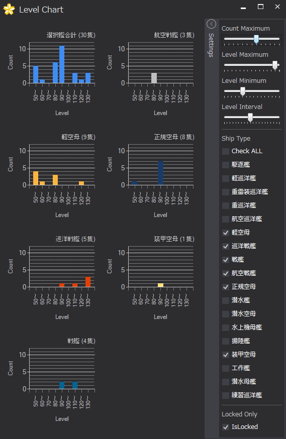
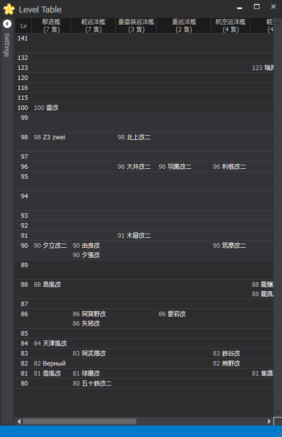

# LevelChartPlugin

艦娘 Level チャート を表示する KanColleViewer Plugin です。

### インストール

* `LvChartPlugin.dll` を KanColleViewer の `Plugins` ディレクトリに放り込んで下さい。

### ライセンス

* [The MIT License (MIT)](LICENSE)

### 使用ライブラリ

#### [KanColleViewer](https://github.com/Grabacr07/KanColleViewer)

> The MIT License (MIT)
> 
> Copyright (c) 2013 Grabacr07

* **ライセンス :** The MIT License (MIT)
* **ライセンス全文 :** [licenses/KanColleViewer.txt](licenses/KanColleViewer.txt)

#### [MetroRadiance](https://github.com/Grabacr07/MetroRadiance)

> The MIT License (MIT)
> 
> Copyright (c) 2014 Manato KAMEYA

* **ライセンス :** The MIT License (MIT)
* **ライセンス全文 :** [licenses/MetroRadiance.txt](licenses/MetroRadiance.txt)

#### [Livet](http://ugaya40.hateblo.jp/entry/Livet)

* **ライセンス :** zlib/libpng

#### [Nekoxy](https://github.com/veigr/Nekoxy)

> The MIT License (MIT)
> 
> Copyright (c) 2015 veigr

* **ライセンス :** The MIT License (MIT)
* **ライセンス全文 :** [licenses/Nekoxy.txt](licenses/Nekoxy.txt)

#### [TrotiNet](https://github.com/krys-g/TrotiNet)

> TrotiNet is a proxy library implemented in C#. It aims at delivering a simple,  
> reusable framework for developing any sort of C# proxies.
> 
> TrotiNet is distributed under the GNU Lesser General Public License v3.0  
> (LGPL). See: http://www.gnu.org/licenses/lgpl.html

* **ライセンス :** GNU LESSER GENERAL PUBLIC LICENSE Version 3
* **ライセンス全文 :** [licenses/LGPL.txt](licenses/LGPL.txt) , [licenses/GPL.txt](licenses/GPL.txt)

#### [Apache log4net](https://logging.apache.org/log4net/)

* **ライセンス :** Apache License Version 2.0
* **ライセンス全文 :** [licenses/Apache.txt](licenses/Apache.txt)

#### [Rx (Reactive Extensions)](https://rx.codeplex.com/)

* **ライセンス :** Apache License Version 2.0
* **ライセンス全文 :** [licenses/Apache.txt](licenses/Apache.txt)
